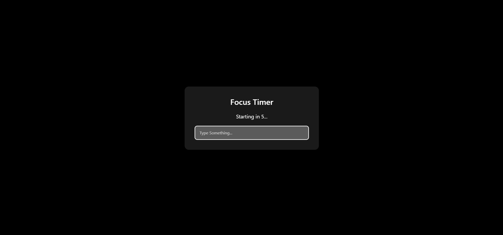

# Auto Focus Timer

Automatically Goes to the Input field by using useRef as soon as the useEffect's internal function setTimeout effects the state variable countDown changes to 0

---

## Demo / Preview

<!-- Add a screenshot, video, or link to live demo -->
  

---

## Features

- Auto Focus After a Certain Time Stamp


---

## Tech Stack

**Client:** React / Vue / HTML-CSS-JS / etc.  

---

## Getting Started

### Prerequisites

- Node.js /

### Installation

```bash
# Clone the repository
git clone https://github.com/adityakalra007/UseRef-AutoFocus

# Move into the project folder
cd UseRef-AutoFocus

# Install dependencies
npm install  

# Start the project
npm run dev  
